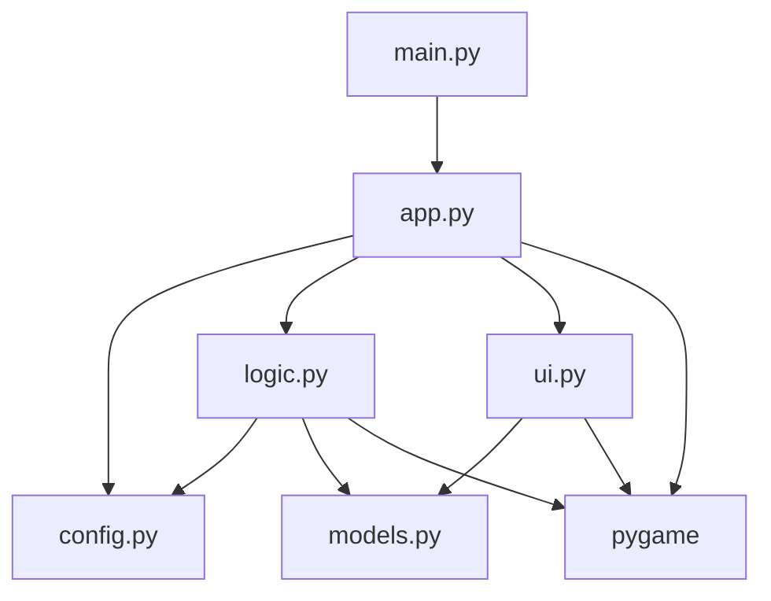
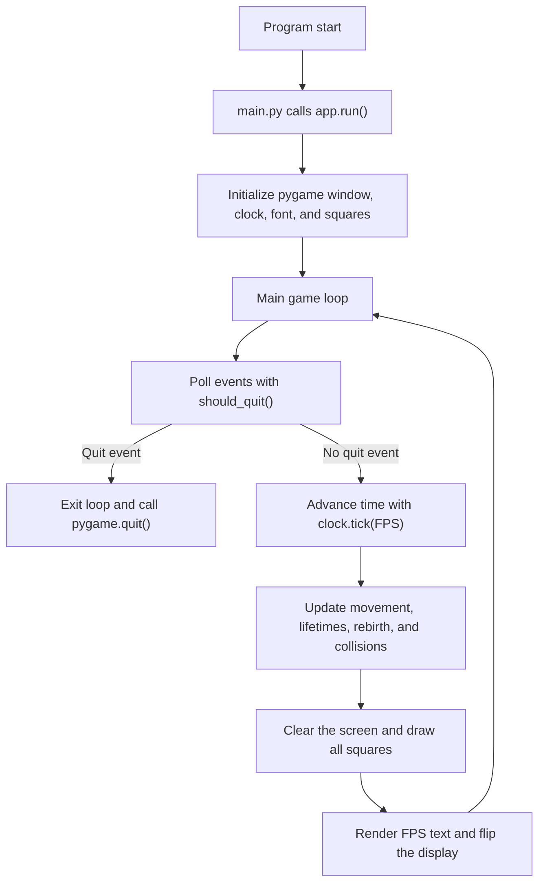
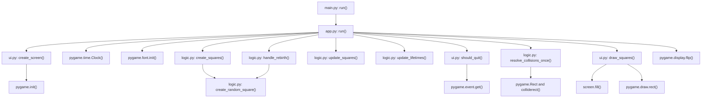
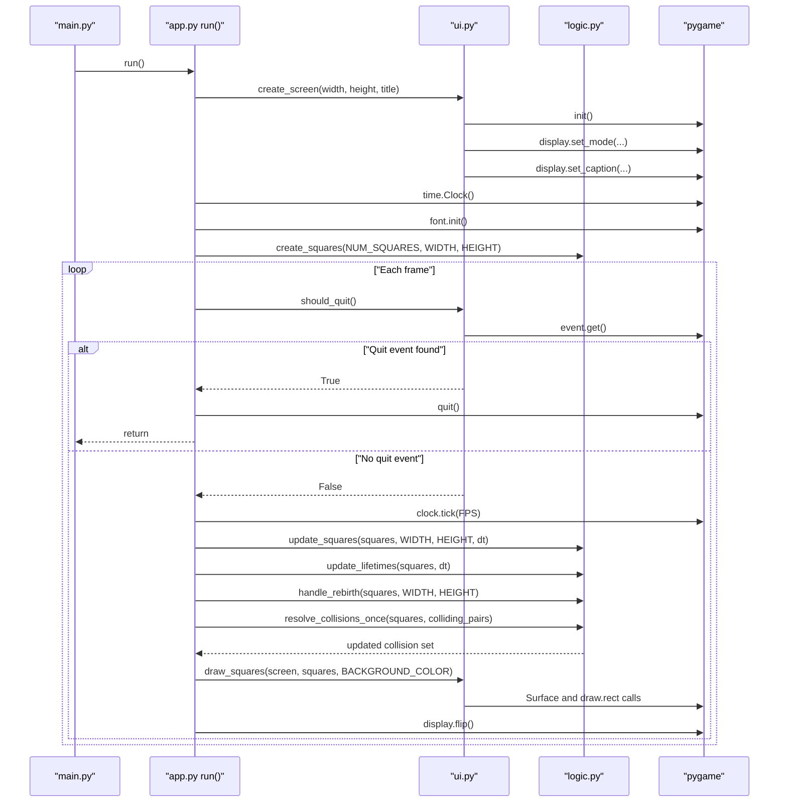

# Project Architecture

This project is a small Pygame simulation built around a narrow entrypoint and four focused modules. `main.py` starts the app, `app.py` owns the loop, `logic.py` updates state, `ui.py` handles pygame-facing work, `models.py` defines the data shape, and `config.py` centralizes constants.

## Module Dependency Graph

`main.py` is only a bootstrapper. The game loop and frame orchestration live in `app.py`, while `logic.py` and `ui.py` keep simulation behavior and rendering behavior separated.

## Runtime Flow

Each frame follows the same order: read input, advance the simulation, render the scene, and present the result.

## Function-Level Call Graph

The central function is `app.run()`. It composes small helpers instead of embedding all behavior in one place, which keeps the code easy to follow.

## Primary Execution Sequence

The main branch point is quitting. If no quit event is present, the loop advances one frame and repeats.

## Assumptions

- The architecture is inferred from the current source files in this workspace.
- There are no hidden runtime modules beyond the files listed above.
- The docs describe the current program structure, not a future refactor plan.
